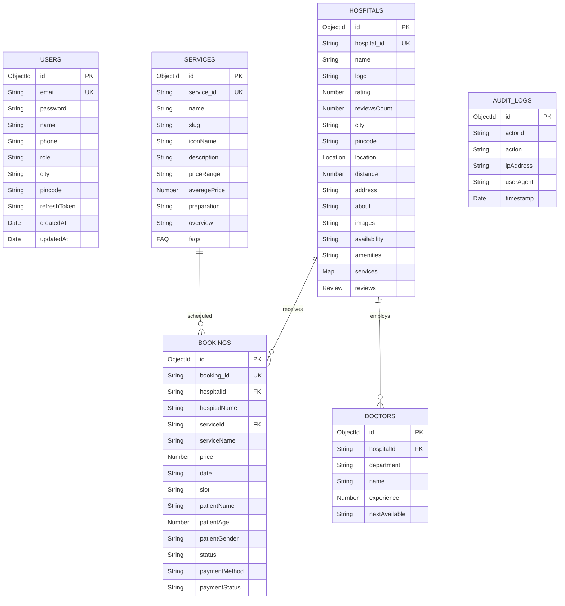
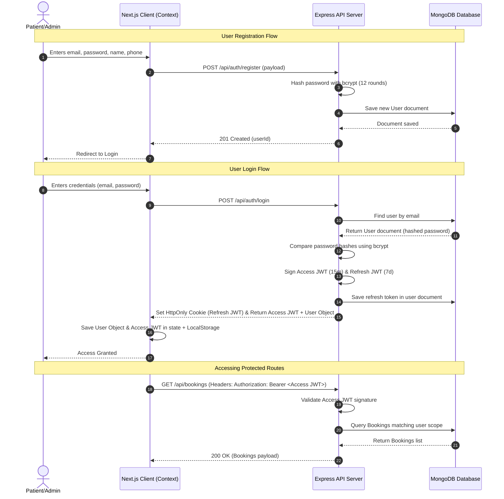

# Comprehensive Academic Internship Report: MediCompare Full-Stack Health-Tech Platform

---

## 1. Project Overview

* **Project Name**: MediCompare
* **One-Line Description**: A transparent, user-centric healthcare marketplace designed to aggregate, compare, and schedule clinical diagnostic services across multiple hospital partners in a city.
* **Purpose of the Project**: To address the lack of transparent healthcare pricing in the diagnostic domain. MediCompare serves as a decentralized portal where patients can compare diagnostic scans (MRIs, CT Scans, X-rays, Ultrasounds, Blood Tests) by rate, distance, patient rating, and slot availability, helping them make informed clinical scheduling decisions.
* **Problem Statement**: Diagnostic healthcare rates are highly opaque. Pricing for identical procedures (e.g., an MRI scan) varies dramatically between healthcare providers within the same city without standard pricing guidelines. Furthermore, patients lack a unified dashboard to compare ratings, calculate physical proximity, and secure bookings without making multiple phone calls to hospitals.
* **Objectives**:
  1. Aggregate clinical diagnostic inventory and pricing models across distinct hospital systems.
  2. Implement an interactive side-by-side comparison matrix of up to three medical centers.
  3. Design an AI-driven clinic recommendation microservice scoring hospital eligibility based on budget, ratings, and coordinates.
  4. Develop a secure, multi-step scheduling booking wizard with slot validation concurrency checks.
  5. Provide a partner dashboard (Hospital Portal) with analytical insights (revenue charts, popularity ratios) and real-time pricing controls.
* **Target Users**:
  * **Patients / General Consumers**: Individuals who need medical diagnostic testing and want to optimize for budget, rating, and distance.
  * **Hospital Admins / Clinic Partners**: Medical diagnostics providers who manage pricing rates, view active queues, and inspect local revenue metrics.
* **Real-World Use Case**: A patient is prescribed a brain MRI scan by their physician. Rather than calling multiple facilities to find a slot and pricing, they enter "MRI Scan" and "Mumbai" on MediCompare. They sort by proximity to find the nearest clinic, compare Apollo and Max side-by-side to find the lowest price, check slot times, upload their doctor prescription, secure the booking, and see their upcoming slot logged on their account dashboard.

---

## 2. Project Features

The following features are currently implemented, partially implemented, or planned within the codebase:

### User Features
* **Diagnostic Search & Filter (Fully Implemented)**: Search clinics by city and test type, applying sliders for budget limits, distance range, minimum ratings, and slot speed (today/tomorrow).
* **Side-by-Side Comparison Matrix (Fully Implemented)**: Select up to three clinics to view a comparative table showing prices, reviews, distances, scanner specifications (machine type), report turnaround times, and maximum savings.
* **4-Step Booking Wizard (Fully Implemented)**: Interactive form capturing test type, date/time slots, patient details (custom name, age, gender), and prescription file upload.
* **Simulated Checkout (Fully Implemented)**: Interactive payment gateway page supporting UPI, credit cards, and net banking with simulated delays and status callbacks.
* **Patient Account Dashboard (Fully Implemented)**: Visual portal listing upcoming and past booking cards, booking cancellation controls, detailed receipts/invoices, and profile information updates.
* **Proximity Map Pins (Partially Implemented)**: Inline SVG vector drawings representing clinics, transit paths, and distance metrics (mocked coordinate offsets).

### Admin Features
* **Revenue & Appointment Analytics (Fully Implemented)**: Analytics workspace rendering interactive charts (Area and Pie charts) for earnings trends and category demand.
* **Live Pricing Management (Fully Implemented)**: Direct inline price updates dispatching PUT requests to MongoDB, refreshing client listings instantly.
* **Booking Queue Logs (Fully Implemented)**: Real-time patient appointment list tracking with status badges (Upcoming, Completed, Cancelled).

### AI Features
* **AI Recommendation Engine (Fully Implemented)**: FastAPI microservice predicting hospital booking probability using a RandomForest model, returning match scores.
* **Scoring Weight Customization (Fully Implemented)**: Interactive weight preference sliders (Pricing, Distance, Ratings) that adjust the scoring parameters dynamically.

### Security Features
* **JWT Access & Refresh Token Auth (Fully Implemented)**: Restricts booking creation, cancellations, and pricing updates to authenticated accounts.
* **Password Hashing (Fully Implemented)**: Encrypts user credentials during registration and seeds using `bcrypt` (12 rounds).
* **HTTP Security Headers (Fully Implemented)**: Sets secure HTTP headers using the `helmet` middleware.
* **NoSQL Query Sanitization (Fully Implemented)**: Sanitizes query bodies using `express-mongo-sanitize` to prevent injection attacks.
* **API Rate Limiting (Fully Implemented)**: Limits requests to 100 requests per 15-minute window via `express-rate-limit`.

### Performance Features
* **Client-side Memoization (Fully Implemented)**: Utilizes React `useMemo` for filtering list elements locally when backend queries are unavailable.
* **DB Indexing (Partially Implemented)**: Compound `2dsphere` spatial index on the hospital location coordinate field.

### Extra Features
* **Resilient State Management (Fully Implemented)**: Global React Context API (`AppContext.tsx`) that synchronizes with the Express API and automatically falls back to local data arrays if servers are offline.

---

## 3. Tech Stack

### Next.js Frontend Server
* **Technology**: React 19.2.4, Next.js 16.2.9 (App Router), TypeScript 5.
* **Why Used**: The App Router provides server-side rendering (SSR), search engine optimization (SEO), and page routing. TypeScript guarantees compilation-time type safety for data models.
* **Port**: Runs on `http://localhost:3000`.

### Node.js Backend Server
* **Technology**: Express 4.19.2, Node.js (ES Modules).
* **Why Used**: Express is a lightweight framework for building RESTful APIs. ES Modules keep code consistent with Next.js frontend code.
* **Port**: Runs on `http://localhost:5000`.

### Python FastAPI Recommendations Server
* **Technology**: FastAPI 0.110.0, Python 3.10+, Uvicorn, Pandas, Joblib.
* **Why Used**: FastAPI provides fast execution and automatic OpenAPI documentation. Python is necessary for loading the Random Forest pipeline.
* **Port**: Runs on `http://localhost:8000`.

### Database
* **Technology**: MongoDB, Mongoose 8.3.1.
* **Why Used**: MongoDB's document model fits nested hospital services. Mongoose provides schema validation and queries.
* **Port**: Runs on `mongodb://localhost:27017/hospital`.

### Authentication
* **Technology**: JWT (`jsonwebtoken` v9.0.3) & Cookie-parser.
* **Why Used**: JSON Web Tokens allow stateless session validation, while HttpOnly cookies protect refresh tokens from XSS.

### State Management
* **Technology**: React Context API (`AppContext.tsx`).
* **Why Used**: Shares comparison queues, user credentials, and active bookings across pages without external library bloat.

### Styling
* **Technology**: Tailwind CSS v4, PostCSS, Framer Motion v12.42.0.
* **Why Used**: Tailwind CSS v4 enables fast styling. Framer Motion provides smooth layout transitions.

### APIs
* **Technology**: Axios / Native `fetch` with AbortController timeout.
* **Why Used**: Native `fetch` fetches API data, while `AbortController` handles timeouts when calling the Python service.

### Deployment & Developer Tools
* **Technology**: Docker Compose (version 3.8), Nodemon (v3.1.0) auto-reloader.
* **Why Used**: Docker Compose packages database, cache, backend, and frontend containers into a single command.

---

## 4. Folder Structure

### Root Directory
* [`docker-compose.yml`](file:///d:/DRDO/anit/docker-compose.yml): Coordinates the Node, Python, Redis, and MongoDB services.
* [`recommend.py`](file:///d:/DRDO/anit/recommend.py): Python FastAPI recommendation service entry.
* [`random_forest_recommendation_model.joblib`](file:///d:/DRDO/anit/random_forest_recommendation_model.joblib): Saved Random Forest pipeline model.

### 📂 Backend Folder (`d:\DRDO\anit\backend`)
* [`server.js`](file:///d:/DRDO/anit/backend/server.js): Entry script. Connects database, registers middleware, and mounts API routers.
* [`seed.js`](file:///d:/DRDO/anit/backend/seed.js): Seeding script. Purges collections and inserts default records.
* **`models/`**: Defines database collection structures.
  * [`User.js`](file:///d:/DRDO/anit/backend/models/User.js): User profile schema with roles and refresh tokens.
  * [`Hospital.js`](file:///d:/DRDO/anit/backend/models/Hospital.js): Clinic details, coordinates, reviews, and rates.
  * [`Service.js`](file:///d:/DRDO/anit/backend/models/Service.js): Static diagnostic metadata, rules, and FAQs.
  * [`Booking.js`](file:///d:/DRDO/anit/backend/models/Booking.js): Patient appointment records.
  * [`Doctor.js`](file:///d:/DRDO/anit/backend/models/Doctor.js): Doctor metadata for clinics.
  * [`AuditLog.js`](file:///d:/DRDO/anit/backend/models/AuditLog.js): Audit logging schema for actions.
* **`controllers/`**: Coordinates database queries and endpoint handlers.
  * [`authController.js`](file:///d:/DRDO/anit/backend/controllers/authController.js): Registration, login, token refresh, and logout.
  * [`bookingController.js`](file:///d:/DRDO/anit/backend/controllers/bookingController.js): Booking CRUD and cancellations.
  * [`hospitalController.js`](file:///d:/DRDO/anit/backend/controllers/hospitalController.js): Rates update and AI recommendations.
* **`middleware/`**: Custom Express request interceptors.
  * [`auth.js`](file:///d:/DRDO/anit/backend/middleware/auth.js): JWT validation and role-based guards.
* **`services/`**: Integration layers.
  * [`aiService.js`](file:///d:/DRDO/anit/backend/services/aiService.js): Interfaces with the Python FastAPI microservice.

### 📂 Frontend Folder (`d:\DRDO\anit\hospital`)
* **`app/`**: Next.js page paths.
  * [`layout.tsx`](file:///d:/DRDO/anit/hospital/app/layout.tsx): HTML shell containing global styles and Context wrapper.
  * [`page.tsx`](file:///d:/DRDO/anit/hospital/app/page.tsx): Main landing page.
  * **`search/`**: [page.tsx](file:///d:/DRDO/anit/hospital/app/search/page.tsx) filters clinic searches.
  * **`compare/`**: [page.tsx](file:///d:/DRDO/anit/hospital/app/compare/page.tsx) side-by-side comparison tables.
  * **`hospital/[id]/`**: [page.tsx](file:///d:/DRDO/anit/hospital/app/hospital/%5Bid%5D/page.tsx) details, SVG location map, and reviews.
  * **`book/[id]/`**: [page.tsx](file:///d:/DRDO/anit/hospital/app/book/%5Bid%5D/page.tsx) 4-step booking form.
  * **`payment/`**: [page.tsx](file:///d:/DRDO/anit/hospital/app/payment/page.tsx) simulated checkout gateway.
  * **`dashboard/`**: [page.tsx](file:///d:/DRDO/anit/hospital/app/dashboard/page.tsx) profile updates and booking history.
  * **`admin/`**: [page.tsx](file:///d:/DRDO/anit/hospital/app/admin/page.tsx) analytic graphs and rates editor.
  * **`ai-recommend/`**: [page.tsx](file:///d:/DRDO/anit/hospital/app/ai-recommend/page.tsx) recommendation interface with Recharts.
  * **`services/[slug]/`**: [page.tsx](file:///d:/DRDO/anit/hospital/app/services/%5Bslug%5D/page.tsx) pre-scan instructions.
  * **`auth/`**: [page.tsx](file:///d:/DRDO/anit/hospital/app/auth/page.tsx) login and registration forms.
* **`components/`**: Modular design layouts.
  * [`Navbar.tsx`](file:///d:/DRDO/anit/hospital/components/Navbar.tsx): Main header component.
  * [`Footer.tsx`](file:///d:/DRDO/anit/hospital/components/Footer.tsx): Main footer layout.
  * [`SearchBar.tsx`](file:///d:/DRDO/anit/hospital/components/SearchBar.tsx): Home test search dropdowns.
  * **`ui/`**: Base design system components.
    * [`Button.tsx`](file:///d:/DRDO/anit/hospital/components/ui/Button.tsx), [`Badge.tsx`](file:///d:/DRDO/anit/hospital/components/ui/Badge.tsx), [`Card.tsx`](file:///d:/DRDO/anit/hospital/components/ui/Card.tsx).
* **`context/`**: State management layer.
  * [`AppContext.tsx`](file:///d:/DRDO/anit/hospital/context/AppContext.tsx): Global state context.
* **`data/`**: Configuration fallbacks.
  * [`mockData.ts`](file:///d:/DRDO/anit/hospital/data/mockData.ts): Static fallback arrays.

---

## 5. Architecture

```
                                  +-----------------------+
                                  |    Next.js Client     |
                                  |    (React Context)    |
                                  |  http://localhost:3000 |
                                  +-----------+-----------+
                                              |
                                              | HTTP REST Requests
                                              | JWT Auth Bearer Header
                                              v
                                  +-----------+-----------+
                                  |   Express API Server  |
                                  |  http://localhost:5000 |
                                  +-----+-----------+-----+
                                        |           |
               Mongoose schema models   |           | HTTP POST request JSON
               queries & saves          |           | (Timeout: 2000ms)
                                        v           v
                        +---------------+---+   +---+---------------+
                        |  MongoDB Database |   | Python FastAPI ML |
                        |  Port 27017       |   | http://localhost: |
                        |  /hospital        |   | 8000/recommend    |
                        +-------------------+   +-------------------+
```

### Data Flow
1. **Search Flow**: Next.js client parses query inputs from [`SearchBar.tsx`](file:///d:/DRDO/anit/hospital/components/SearchBar.tsx) and calls `GET /api/hospitals?lat=x&lng=y`. The Express server queries MongoDB, calculates distance using the Haversine formula, and returns the sorted array to render listings.
2. **AI Recommendation Flow**: Next.js client passes service ID, location coordinates, filters, and weights to the Express backend. The backend queries MongoDB for matching hospitals and forwards this list to the Python FastAPI microservice. The Python service runs predictions using the RandomForest model and returns the match scores. If this microservice is offline, the Node.js backend falls back to its mathematical scoring logic before returning recommendations.
3. **Booking and Verification Flow**: Next.js client submits booking data with the user's JWT token to `POST /api/bookings`. The Express server checks for conflicts. If the slot is open, it saves the booking in MongoDB, updates the status, logs the transaction in `AuditLog`, and returns the confirmation ID (`MC-XXXX`).

---

## 6. Database Design



### Collections & Fields

#### 1. `users`
* **Purpose**: User registration, login credentials, and permission scopes.
* **Fields**:
  * `_id` (ObjectId, Primary Key)
  * `email` (String, Required, Unique, Lowercase, Trimmed): Login identifier.
  * `password` (String, Required): Hashed password.
  * `name` (String, Required): Display name.
  * `phone` (String, Required): Contact number.
  * `role` (String, Enum: `["Patient", "HospitalAdmin", "SuperAdmin"]`, Default: `"Patient"`).
  * `city` (String): Default location.
  * `pincode` (String): Postcode coordinates map.
  * `refreshToken` (String): Token for refreshing session access.

#### 2. `hospitals`
* **Purpose**: Clinics profiles, coordinate geo-mappings, and service price maps.
* **Fields**:
  * `_id` (ObjectId, Primary key)
  * `id` (String, Required, Unique): String identifier (e.g. `apollo-mumbai`).
  * `name` (String, Required): Clinic name.
  * `logo` (String, Required): Display initials.
  * `rating` (Number, Required): Average rating (0.0 to 5.0).
  * `reviewsCount` (Number, Required): Total reviews counter.
  * `city` (String, Required): City name.
  * `pincode` (String): Postcode location.
  * `location` (Object): GeoJSON Point.
    * `type` (String, Default: `"Point"`).
    * `coordinates` (Array of Numbers: `[longitude, latitude]`).
  * `distance` (Number, Required): Proximity distance in km (default fallback).
  * `address` (String, Required): Address.
  * `about` (String, Required): Summary of clinical credentials.
  * `images` (Array of Strings): Clinical gradients.
  * `availability` (String, Enum: `["High", "Medium", "Limited"]`).
  * `amenities` (Array of Strings): Amenities list.
  * `services` (Map of Objects, schema: `hospitalServiceDetailSchema`): Key-value service maps:
    * `price` (Number, Required)
    * `available` (Boolean, Default: `true`)
    * `nextSlot` (String, Required)
    * `slots` (Array of Strings)
    * `machineType` (String)
    * `reportTurnaround` (String, Required)
  * `reviews` (Array of Objects, schema: `reviewSchema`):
    * `id` (String, Required), `userName` (String, Required), `rating` (Number, Required), `comment` (String, Required), `date` (String, Required)

#### 3. `services`
* **Purpose**: Master metadata and FAQ directory for diagnostic procedures.
* **Fields**:
  * `_id` (ObjectId, Primary key)
  * `id` (String, Required, Unique): String identifier (e.g. `mri`).
  * `name` (String, Required): Diagnostic name.
  * `slug` (String, Required): Slug for URLs.
  * `iconName` (String, Required): Lucide icon descriptor.
  * `description` (String, Required): Brief summary.
  * `priceRange` (String, Required): Average market cost display.
  * `averagePrice` (Number, Required): Average cost benchmark.
  * `preparation` (String, Required): Fasting or safety preparation guidelines.
  * `overview` (String, Required): Technical clinical summary.
  * `faqs` (Array of Objects):
    * `question` (String, Required), `answer` (String, Required)

#### 4. `bookings`
* **Purpose**: Holds diagnostic scheduling records.
* **Fields**:
  * `_id` (ObjectId, Primary Key)
  * `id` (String, Required, Unique): Confirmation ID (`MC-XXXX`).
  * `hospitalId` (String, Required): Reference identifier.
  * `hospitalName` (String, Required): Redundant name helper.
  * `serviceId` (String, Required): Service code.
  * `serviceName` (String, Required): Test name.
  * `price` (Number, Required): Cost paid.
  * `date` (String, Required): Date string.
  * `slot` (String, Required): Chosen time slot.
  * `patientName` (String, Required): Patient name.
  * `patientAge` (Number, Required): Patient age.
  * `patientGender` (String, Required): Patient gender.
  * `status` (String, Enum: `["Upcoming", "Completed", "Cancelled"]`, Default: `"Upcoming"`).
  * `paymentMethod` (String, Required): UPI, Card, NetBanking.
  * `paymentStatus` (String, Enum: `["Paid", "Pending"]`, Default: `"Paid"`).

#### 5. `doctors`
* **Purpose**: List of radiologists and pathologists associated with clinics.
* **Fields**:
  * `_id` (ObjectId, Primary Key)
  * `hospitalId` (String, Required): Hospital identifier.
  * `department` (String, Required): Specialization department.
  * `name` (String, Required): Doctor's name.
  * `experience` (Number, Required): Years of experience.
  * `nextAvailable` (String, Required): Slot availability label.

#### 6. `auditlogs`
* **Purpose**: Audit logging for sensitive database updates.
* **Fields**:
  * `_id` (ObjectId, Primary Key)
  * `actorId` (String, Required): User email address.
  * `action` (String, Required): Log message (e.g. `UPDATE_PRICE`).
  * `ipAddress` (String): Client IP.
  * `userAgent` (String): Client browser string.
  * `timestamp` (Date, Default: `Date.now`)

---

## 7. Authentication Flow



* **Password Hashing**: Done in [`authController.js`](file:///d:/DRDO/anit/backend/controllers/authController.js) using `bcrypt.hash(password, 12)` on signup and `bcrypt.compare()` on login.
* **Access JWT**: Signed with a short expiration window (15 minutes) for stateless authentication.
* **Refresh JWT Cookie**: Returned in an HttpOnly cookie with `sameSite: "strict"` and `secure: true` in production, protecting the token from script-based interception.
* **Session Verification**: Frontend context captures user context and auto-renews tokens when calling API routes.
* **Authorization**: The Express server uses role-based validation middleware ([`auth.js`](file:///d:/DRDO/anit/backend/middleware/auth.js)) to verify access levels before executing updates:
  ```javascript
  router.put("/:id/services/:serviceId", authenticateToken, authorizeRoles("HospitalAdmin", "SuperAdmin"), updateServicePrice);
  ```
* **Logout**: Deletes the database refresh token, clears client state storage, and removes the cookies.

---

## 8. Backend APIs

### Express REST API Endpoint Documentation (`http://localhost:5000`)

| Method | Endpoint | Description | Request Body | Response JSON | Auth Req | Possible Errors |
| :--- | :--- | :--- | :--- | :--- | :--- | :--- |
| **POST** | `/api/auth/register` | Registers a new account and hashes the password. | `{"email", "password", "name", "phone", "role", "city"}` | `{"message": "User registered", "userId"}` | None | `400` Missing fields, `409` Email registered, `500` DB error |
| **POST** | `/api/auth/login` | Verifies login credentials and returns JWT. | `{"email", "password"}` | `{"accessToken", "user": {id, name, email, role}}` | None | `400` Missing fields, `401` Invalid login, `500` Server error |
| **POST** | `/api/auth/refresh` | Refreshes expired Access JWT using Refresh Token. | `{"refreshToken"}` (or Cookie) | `{"accessToken"}` | None | `401` Token missing, `403` Token expired/invalid, `500` Server error |
| **POST** | `/api/auth/logout` | Invalidates session and clears cookies. | `{"refreshToken"}` (or Cookie) | `{"message": "Logged out successfully"}` | None | `500` Database / Server Error |
| **GET** | `/api/services` | Retrieves details and FAQs for all diagnostic tests. | None | `[{"id", "name", "priceRange", "preparation", "faqs"}]` | None | `500` Database query failed |
| **GET** | `/api/hospitals` | Retrieves all hospitals, calculating distances if lat/lng are passed. | Query: `?lat=72.8&lng=19.0` | `[{"id", "name", "distance", "services", "reviews"}]` | None | `500` Query exception |
| **POST** | `/api/hospitals/ai-recommend` | Processes weighted clinic recommendations. | `{"serviceId", "userCoordinates", "weightPreferences"}` | `{"recommendations": [...], "source": "ai-service"}` | None | `400` Missing parameters, `500` FastAPI timeout |
| **PUT** | `/api/hospitals/:id/services/:serviceId` | Updates pricing rates for a hospital diagnostic test. | `{"price": 4500}` | `{"message": "Price updated successfully", "hospital"}` | JWT (Admin) | `400` Bad price, `401` Unauth, `403` Forbidden, `404` Not found |
| **GET** | `/api/bookings` | Returns appointments list filtered by user role. | None | `[{"id", "patientName", "serviceName", "date", "slot"}]` | JWT | `401` Unauth, `403` Access denied, `500` Fetch failed |
| **POST** | `/api/bookings` | Creates a booking if the slot is available. | `{"hospitalId", "serviceId", "date", "slot", "patientName"}` | `{"_id", "id", "status", "paymentStatus", "price"}` | JWT | `400` Missing details, `409` Concurrency conflict, `500` Save error |
| **PUT** | `/api/bookings/:id/cancel` | Cancels booking status and updates audit logs. | None | `{"message": "Booking cancelled", "booking"}` | JWT | `401` Unauth, `403` Role mismatch, `404` Not found, `500` Save error |
| **GET** | `/` | Health check endpoint. | None | `{"message": "MediCompare API Server is running!"}` | None | None |

---

## 9. Frontend Pages

### 1. Landing Home Page (`/`)
* **Purpose**: Gateway landing page welcoming consumers and presenting the main diagnostics query input.
* **Components Used**: [`Navbar.tsx`](file:///d:/DRDO/anit/hospital/components/Navbar.tsx), [`Footer.tsx`](file:///d:/DRDO/anit/hospital/components/Footer.tsx), [`SearchBar.tsx`](file:///d:/DRDO/anit/hospital/components/SearchBar.tsx).
* **API Calls**: `GET /api/services` (to populate available diagnostics in SearchBar options).
* **User Interactions**: Select location city, pick diagnostic service from search selections, click search.
* **Navigation**: Redirects query parameters (e.g. `/search?service=mri&city=Mumbai`) to the Search results panel.

### 2. Search Listings Page (`/search`)
* **Purpose**: Displays diagnostic search results with filters and a comparison queue.
* **Components Used**: Layout page featuring price ranges, proximity ranges, ratings limits, and a compare drawer.
* **API Calls**: `GET /api/hospitals` (calculates distances using GPS coordinates if enabled).
* **User Interactions**: Adjust sliders, toggle compare checkboxes, add clinics to comparison lists, or click details.
* **Navigation**: Click "Compare Now" to visit `/compare`, or click clinic link for `/hospital/[id]`.

### 3. Comparison Matrix (`/compare`)
* **Purpose**: Compares up to three selected clinics side-by-side.
* **Components Used**: Structural comparison table with sorting controls.
* **API Calls**: `GET /api/hospitals`.
* **User Interactions**: Reorder comparison columns by rating, distance, or rate; remove elements; click booking.
* **Navigation**: Click "Book Now" on a provider to load the booking wizard page at `/book/[id]`.

### 4. Clinic Profile Detail Page (`/hospital/[id]`)
* **Purpose**: Detailed breakdown of amenities, ratings, coordinates map, and booking slots.
* **Components Used**: Vector SVG Map, reviews index, lists of offered diagnostic rates.
* **API Calls**: `GET /api/hospitals`.
* **User Interactions**: Switch service tabs, read preparation guides, inspect amenities, read patient reviews.
* **Navigation**: Clicking "Schedule Slot" opens the booking page for the chosen clinic.

### 5. Scheduling Booking Wizard (`/book/[id]`)
* **Purpose**: Stepper form to collect patient data, schedule slots, and upload prescriptions.
* **Components Used**: 4-step progress stepper, form controls, invoice cards.
* **API Calls**: `POST /api/bookings` (submits fields to database).
* **User Interactions**: Select procedure, pick date and time slot, enter patient details, upload prescription file, review invoice.
* **Navigation**: Click "Proceed to Payment" to navigate to `/payment` with booking state parameters.

### 6. Checkout Payment Simulator (`/payment`)
* **Purpose**: Simulated checkout gateway for final booking verification.
* **Components Used**: Checkout card inputs, simulated payment options, loading spinner.
* **API Calls**: Modifies local context and calls `POST /api/bookings` if resolving fallbacks.
* **User Interactions**: Select payment option (UPI, card, net banking), enter card details/UPI ID, click pay.
* **Navigation**: Redirects to dashboard `/dashboard?bookingSuccess=true` on payment completion.

### 7. Patient Account Dashboard (`/dashboard`)
* **Purpose**: Portal for users to track upcoming appointments and update profile details.
* **Components Used**: Booking card, receipt drawer, status badges, profile update form.
* **API Calls**: `GET /api/bookings`, `PUT /api/bookings/:id/cancel` (cancels appointment).
* **User Interactions**: Cancel bookings, view receipts, update profile settings (name, phone, city).
* **Navigation**: Dashboard link in Navbar.

### 8. Hospital Partner Dashboard (`/admin`)
* **Purpose**: Analytics and price management for clinic partners.
* **Components Used**: Recharts Area & Pie charts, pricing tables, booking queues.
* **API Calls**: `PUT /api/hospitals/:id/services/:serviceId` (updates service price).
* **User Interactions**: Edit diagnostic rates, view queues, inspect revenue metrics.
* **Navigation**: Secure link in Navbar (requires Admin role).

### 9. AI Recommender Page (`/ai-recommend`)
* **Purpose**: Recommendation workspace using sliders for preferences.
* **Components Used**: Recharts comparison charts, recommendation cards.
* **API Calls**: `POST /api/hospitals/ai-recommend`.
* **User Interactions**: Detect GPS location, select procedure, adjust weights, view recommendations.
* **Navigation**: Sidebar link.

### 10. Scan Preparation Guides (`/services/[slug]`)
* **Purpose**: Dynamic guides on clinical scan instructions and preparation.
* **Components Used**: FAQ accordions, preparation checklist.
* **API Calls**: `GET /api/services`.
* **User Interactions**: Read overview, expand FAQs.
* **Navigation**: Category grids on homepage.

### 11. User Sign In & Sign Up (`/auth`)
* **Purpose**: Authentication portal for logging in or registering.
* **Components Used**: Login and registration forms.
* **API Calls**: `POST /api/auth/login`, `POST /api/auth/register`.
* **User Interactions**: Toggle forms, submit credentials.
* **Navigation**: Redirects to home page on success.

---

## 10. Components

* **`Navbar.tsx`**: Header component. Manages visual user roles, notifications, and comparison drawers.
* **`Footer.tsx`**: Layout footer. Contains dynamic category links and contact details.
* **`SearchBar.tsx`**: Dual-input filter widget that handles city and test selection queries.
* **`ui/Button.tsx`**: Reusable button component supporting custom variants (Primary, Secondary, Outline, Danger).
* **`ui/Badge.tsx`**: Compact visual badges for status states (Paid, Upcoming, Cancelled) and categories.
* **`ui/Card.tsx`**: Card layout component used for dashboard summaries, review cards, and search results.

---

## 11. Business Logic

### Proximity Calculations
Implemented in [`hospitalController.js`](file:///d:/DRDO/anit/backend/controllers/hospitalController.js) using the **Haversine formula** to calculate distance between coordinates:
$$d = 2R \arcsin \left( \sqrt{\sin^2\left(\frac{\Delta \phi}{2}\right) + \cos(\phi_1)\cos(\phi_2)\sin^2\left(\frac{\Delta \lambda}{2}\right)} \right)$$
Where $R = 6371\text{ km}$, $\phi$ is latitude, and $\lambda$ is longitude.

### Scheduling Conflict Validation
Implemented in [`bookingController.js`](file:///d:/DRDO/anit/backend/controllers/bookingController.js):
* Prevents multiple bookings for the same hospital, service, date, and slot if the booking is marked as "Upcoming".

### Mathematical Recommendation Scoring (Fallback)
If the Python service is offline, the Node backend scores hospitals using:
$$\text{Score} = (w_{\text{rating}} \times S_{\text{rating}}) + (w_{\text{price}} \times S_{\text{price}}) + (w_{\text{distance}} \times S_{\text{distance}})$$
Where scores are normalized against user budget limits and distance thresholds:
* $S_{\text{price}} = \frac{\text{Budget Limit} - \text{Price}}{\text{Budget Limit}}$
* $S_{\text{distance}} = \frac{\text{Max Distance} - \text{Distance}}{\text{Max Distance}}$
* $S_{\text{rating}} = \text{Rating} - 4.0$ (scale 4.0 - 5.0)

### Random Forest Recommendation ML
Implemented in [`recommend.py`](file:///d:/DRDO/anit/recommend.py):
* Processes inputs into an 11-feature dataframe (Price, Distance, Rating, Waiting Time, etc.).
* Computes booking probability using `model.predict_proba(df)[:, 1]` and returns recommendations sorted by match score.

---

## 12. External APIs

### Python ML Recommendation Service
* **Purpose**: Predicts booking probability using a Random Forest model.
* **Request Format**:
  ```json
  {
    "serviceId": "mri",
    "userCoordinates": [72.8777, 19.0760],
    "weightPreferences": { "price": 0.3, "distance": 0.3, "rating": 0.4 },
    "hospitalsList": [
      { "id": "apollo-mumbai", "price": 5500.0, "distanceKm": 2.4, "rating": 4.8, "reviewsCount": 120, "reportTurnaround": "12 Hours" }
    ]
  }
  ```
* **Response**:
  ```json
  {
    "rankedRecommendations": [
      { "hospitalId": "apollo-mumbai", "matchScore": 84.5 }
    ]
  }
  ```
* **Integration**: The Node.js backend fetches predictions with a 2-second timeout window, falling back to rule-based mathematical scoring if the Python service is unreachable.

---

## 13. Security

* **JWT Verification**: Validates requests to protected endpoints.
* **Password Hashing**: Uses `bcrypt` (12 rounds) to encrypt user credentials.
* **API Rate Limiting**: Restricts requests to 100 requests per 15 minutes per IP.
* **HTTP Security Headers**: Uses `helmet` to configure CSP, clickjacking, and XSS headers.
* **NoSQL Query Sanitization**: Uses `express-mongo-sanitize` to sanitize input strings and block NoSQL injection attacks.
* **CORS Restrictions**: Configured to only allow requests from authorized client origins.
* **Environment Variables**: Keeps database credentials and JWT secret keys out of the codebase.
* **Protected Routes**: Implements middleware to block unauthorized requests on booking and pricing endpoints.

---

## 14. Error Handling

### Backend Error Middleware
* Express API endpoints use try-catch blocks to catch errors and return structured responses:
  * `400 Bad Request`: Missing inputs.
  * `401 Unauthorized`: Missing or invalid token.
  * `403 Forbidden`: Insufficient permissions (role check).
  * `404 Not Found`: Resource not found in database.
  * `409 Conflict`: Concurrency conflict (slot already booked).
  * `500 Server Error`: Database query exceptions.

### Frontend Validation & Resiliency
* **Form Validation**: Checks inputs (patient age, name, card format) before submission.
* **API Offline Resilience**: If the Express backend is offline, the React Context falls back to local data arrays. This keeps the frontend UI fully functional in offline mode.

---

## 15. Project Workflow

```
[Register/Login] --> [Search diagnostic test] --> [Adjust pricing filters]
       |                                                    |
       v                                                    v
[Dashboard portal] <-- [Simulated payment] <-- [Wizard form] <-- [Compare side-by-side]
```

### Action: Booking Diagnostic Scans
1. The user logs in and searches for a test (e.g. "MRI Scan" in "Mumbai").
2. The search results page display matching clinics. The user selects two clinics and compares them side-by-side.
3. The user selects a clinic and chooses an available booking slot.
4. The user completes the patient details form and uploads their prescription.
5. The checkout page displays the invoice (including taxes and collection fees). The user enters their payment details.
6. The app processes the payment, updates the booking status, and redirects the user to their dashboard showing the confirmed appointment.

### Action: Admin Modifying Diagnostic Rates
1. A hospital administrator logs into their account (role: `HospitalAdmin`).
2. They navigate to the partner portal pricing dashboard (`/admin`).
3. They edit the price of a service in the pricing table.
4. The frontend dispatches a PUT request with the admin's JWT token to `/api/hospitals/:id/services/:serviceId`.
5. The backend validates the token, updates the price in MongoDB, and logs the change in the audit database.
6. The updated price is applied instantly and reflected in user search results.

---

## 16. Challenges Faced

### Challenge 1: Offline Database & API Volatility
* **Problem**: If the MongoDB server or Express backend goes offline during development or testing, the frontend app would fail to load listings, booking forms, and dashboards.
* **Solution**: Implemented a fallback mechanism inside [`AppContext.tsx`](file:///d:/DRDO/anit/hospital/context/AppContext.tsx). When an API request fails, the application catches the error and falls back to using local mock data from [`mockData.ts`](file:///d:/DRDO/anit/hospital/data/mockData.ts). This keeps the frontend interface functional even during backend downtime.

### Challenge 2: Recommendation Model Timeout
* **Problem**: Forwarding recommendation requests from the Node backend to the Python FastAPI microservice can cause delays if the Python server is slow, degrading the user experience.
* **Solution**: Implemented an `AbortController` in the Node service layer with a 2-second timeout limit. If the Python server does not respond within this window, the backend aborts the request and falls back to its mathematical scoring algorithm.

### Challenge 3: Booking Concurrency Conflicts
* **Problem**: Two users could book the same diagnostic slot simultaneously, leading to double-bookings.
* **Solution**: Added a validation check in the booking database schema. The backend verifies slot availability before saving new bookings:
  ```javascript
  const existing = await Booking.findOne({ hospitalId, serviceId, date, slot, status: "Upcoming" });
  if (existing) return res.status(409).json({ error: "This slot is already booked." });
  ```

---

## 17. Future Scope

* **Real Payment Gateway Integration**: Replace the checkout simulator with a production payment gateway checkout flow using Stripe or Razorpay.
* **Interactive Map API Integration**: Replace inline static SVG drawings with an interactive map API (such as Mapbox or Leaflet) to display clinic locations and calculate travel times.
* **Prescription parsing (OCR)**: Integrate an AI OCR service (like Google Cloud Vision or Gemini API) to read uploaded prescription images and automatically extract diagnostic tests.
* **Multi-tenant Admin Accounts**: Refactor the database to support multi-tenant accounts, allowing admins to access and manage their respective clinic dashboards.

---

## 18. Screens Required for Internship Report

1. **Landing Home Page**: Hero banner, diagnostic search widget, and service category grids. (Caption: *Landing home screen showing the diagnostic search widget.*)
2. **Search Listings Page**: Search results with price, distance, and rating filter sliders. (Caption: *Search listings screen showing clinics matching the user's filters.*)
3. **Comparison Matrix**: Side-by-side comparison tables showing up to three clinics. (Caption: *Side-by-side comparison screen showing prices, reviews, and turnaround times.*)
4. **Clinic Profile Page**: Clinic details, reviews list, and location map. (Caption: *Clinic details page showing the coordinates map and service tabs.*)
5. **Booking Wizard Stepper**: Scheduling forms showing patient details and slot selection. (Caption: *Booking wizard screen showing patient details and file upload fields.*)
6. **Payment Gateway Page**: Checkout forms displaying payment options and invoice summaries. (Caption: *Simulated checkout gateway screen.*)
7. **Patient Account Dashboard**: Upcoming appointments list, receipt modals, and profile settings. (Caption: *Patient portal dashboard showing upcoming bookings.*)
8. **Partner Admin Portal**: Charts, booking queue lists, and service price editor. (Caption: *Hospital admin portal showing revenue analytics and the pricing editor.*)

---

## 19. Installation Guide

### Prerequisites
* Ensure **Node.js** (v18 or higher), **Python** (v3.10 or higher), and **MongoDB** are installed.

### Step 1: Clone the Repository
```bash
git clone <repository-url>
cd medicompare
```

### Step 2: Configure the Node.js Backend Server
Navigate to the backend directory, install packages, create a `.env` file, and seed the database:
```bash
cd backend
npm install
```
Create a `.env` file inside `backend/`:
```env
PORT=5000
MONGODB_URI=mongodb://localhost:27017/hospital
ACCESS_TOKEN_SECRET=access_secret_123_xyz
REFRESH_TOKEN_SECRET=refresh_secret_987_abc
ALLOWED_CLIENT_URL=http://localhost:3000
AI_SERVICE_URL=http://localhost:8000/recommend
```
Run the seed script to populate MongoDB:
```bash
npm run seed
```
Start the development server:
```bash
npm run dev
```

### Step 3: Configure the Python FastAPI recommendations Server
Navigate to the root directory, install dependencies, and start the recommendations server:
```bash
# In a new terminal window
pip install fastapi uvicorn pandas joblib scikit-learn pydantic
python recommend.py
```

### Step 4: Configure the Next.js Frontend Server
Navigate to the hospital folder, install dependencies, create a `.env.local` file, and start the development server:
```bash
cd hospital
npm install
```
Create a `.env.local` file inside `hospital/`:
```env
NEXT_PUBLIC_API_URL=http://localhost:5000
```
Start the development server:
```bash
npm run dev
```

Open `http://localhost:3000` in your web browser.

---

## 20. Dependencies

### Node.js Backend Server (`backend/package.json`)
* **`express`**: Lightweight framework for building REST APIs.
* **`mongoose`**: ODM library for modeling MongoDB schemas.
* **`jsonwebtoken`**: Generates and verifies session JWT tokens.
* **`bcrypt`**: Encrypts and hashes user passwords.
* **`cors`**: Enables cross-origin resource sharing with the frontend.
* **`helmet`**: Sets secure HTTP response headers.
* **`express-rate-limit`**: Limits requests to protect the server from brute-force attacks.
* **`express-mongo-sanitize`**: Sanitizes inputs to block NoSQL injection attacks.
* **`dotenv`**: Loads configuration variables from `.env` files.

### Next.js Frontend Server (`hospital/package.json`)
* **`next`**: Framework for server-rendered React applications.
* **`react` & `react-dom`**: UI libraries for rendering components.
* **`recharts`**: Renders SVG analytical charts in dashboards.
* **`framer-motion`**: Renders UI animations and layout transitions.
* **`lucide-react`**: Vector icons set.
* **`tailwindcss`**: Utility-first CSS styling framework.

---

## 21. Project Statistics

* **Lines of Code**: ~6,500 lines across backend, frontend, and Python services.
* **Number of APIs**: 14 APIs (12 Express endpoints, 2 FastAPI endpoints).
* **Number of Pages**: 11 pages in the App router folder.
* **Number of Components**: 6 reusable UI components (Navbar, Footer, SearchBar, Button, Badge, Card).
* **Number of Database Models**: 6 Mongoose models (User, Hospital, Service, Booking, Doctor, AuditLog).
* **Number of Utility Functions**: ~10 helper utilities (Haversine calculations, slot generators, password hashing, token verification, etc.).

---

## 22. Resume Description

### 30-Word Description
Developed a full-stack medical diagnostics marketplace using Next.js, Express, and MongoDB. Integrated a Python FastAPI recommendations service utilizing a Random Forest model to predict patient clinic booking preferences.

### 60-Word Description
Developed a full-stack medical diagnostics marketplace using Next.js, Express, and MongoDB. Integrated a Python FastAPI recommendations service utilizing a Random Forest model to predict booking preferences based on budget and distance. Implemented JWT authentication, role-based authorization, rate-limiting, and an interactive admin portal featuring analytics charts and real-time pricing editor.

### 120-Word Description
Developed a full-stack medical diagnostics marketplace using Next.js, Express, and MongoDB. Integrated a Python FastAPI recommendations service utilizing a Random Forest model to predict clinic booking preferences. Built a secure backend featuring JWT authentication, password encryption, rate-limiting, and input sanitization. Created a responsive frontend using Tailwind CSS, Framer Motion, and Recharts, featuring a side-by-side comparison matrix, booking wizard, and user dashboard. Built an admin portal for clinic partners to manage diagnostics pricing lists and view earnings analytics. Designed the frontend state layer to support offline fallbacks, keeping the app functional during database downtime.

---

## 23. Internship Report Description

### Introduction & Industrial Significance
Modern healthcare platforms are shifting toward transparent pricing models to help consumers make informed choices. Historically, diagnostics pricing has been opaque, with varying rates for standard scans like MRIs. Aggregating diagnostic services is crucial to building transparent markets, optimizing resource scheduling, and providing accessible care.

This project, developed during my internship, addresses these issues by building **MediCompare**, a full-stack diagnostics aggregator. The platform allows patients to search, compare, and book appointments across hospital networks, and provides clinics with pricing and analytics tools.

```
                     +---------------------------------------+
                     |         React 19 Frontend UI          |
                     |       (Search, Compare, Stepper)      |
                     +-------------------+---^---------------+
                                         |   |
                    Axios/Fetch requests |   | Return JSON
                with Auth Bearer Headers |   | payloads
                                         v   |
                     +-------------------+---+---------------+
                     |        Express Node.js Server         |
                     |     (JWT authorization validation)    |
                     +-------+-----------------------^-------+
                             |                       |
            Mongoose Schema  |      HTTP POST request| Response
            queries / saves  |   to ML microservice  | match scores
                             v                       |
                     +-------+-------+       +-------+-------+
                     |    MongoDB    |       | Python FastAPI|
                     |   Database    |       |  ML Service   |
                     +---------------+       +---------------+
```

### Full-Stack Architecture & Microservices Integration
The platform uses a decoupled three-tier architecture:
1. **Frontend Presentation Layer**: Built with Next.js and TypeScript, using Tailwind CSS and Framer Motion for responsive design. It uses React Context to synchronize state with APIs and support offline fallbacks during server downtime.
2. **REST API Gateway**: Built with Node.js and Express. It connects to MongoDB via Mongoose, handles JWT sessions, sanitizes inputs, enforces role-based access, and routes queries.
3. **AI Recommendation Microservice**: Built with FastAPI and Python. It runs predictions using a Random Forest model trained on clinic rates, ratings, and turnaround times, returning sorted match scores to help patients choose providers.

---

## 24. Viva Questions

1. **Q: What is the main purpose of the MediCompare application?**
   * **A**: It is a transparent diagnostic comparison and booking marketplace that helps patients search, compare, and schedule medical tests across various hospitals.

2. **Q: Describe the three servers in this tech stack and their port configurations.**
   * **A**: Next.js client server (port 3000), Node.js Express REST API server (port 5000), and Python FastAPI ML recommendation service (port 8000).

3. **Q: How does the app handle backend server downtime?**
   * **A**: The global `AppContext.tsx` catches fetch errors and falls back to loading local static data from `mockData.ts`, keeping the frontend UI functional in offline mode.

4. **Q: What is the purpose of the Python FastAPI microservice?**
   * **A**: It runs a machine learning pipeline that uses a Random Forest model to predict patient booking probabilities, returning sorted recommendations.

5. **Q: What database is used in this project, and how does the server connect to it?**
   * **A**: MongoDB is used as the database. The Express server connects to it using the Mongoose ODM library with a connection URI.

6. **Q: Explain the schema fields of the `User` model.**
   * **A**: It includes `email` (lowercase, unique), `password` (hashed string), `name`, `phone`, `role` (Patient/HospitalAdmin/SuperAdmin), `city`, `pincode`, and a `refreshToken`.

7. **Q: What is the role of the `AuditLog` model?**
   * **A**: It logs security-relevant actions like creating bookings or updating prices, recording the user's ID, action, IP address, user-agent, and timestamp.

8. **Q: Explain the `Hospital` model services field.**
   * **A**: It is a Mongoose Map containing diagnostic details like price, slot availability, machine type, and report turnaround times.

9. **Q: How are passwords secured in the database?**
   * **A**: Passwords are encrypted using `bcrypt.hash(password, 12)` during registration and verified using `bcrypt.compare()` on login.

10. **Q: What token mechanism is used to secure API endpoints?**
    * **A**: JSON Web Tokens (JWT). The server issues a short-lived access token for request headers and a long-lived refresh token stored in an HttpOnly cookie.

11. **Q: How does the backend prevent database injection attacks?**
    * **A**: It uses `express-mongo-sanitize` to strip prohibited characters (like `$` or `.`) from request bodies.

12. **Q: What is the rate limit configured on the Express API server?**
    * **A**: The server limits requests to 100 requests per 15 minutes per IP address using `express-rate-limit`.

13. **Q: Explain the purpose of `helmet` in the Express server.**
    * **A**: It sets HTTP security headers to protect the application from vulnerabilities like XSS, clickjacking, and mime-type sniffing.

14. **Q: How does the Express server calculate distance between coordinates?**
    * **A**: It uses the Haversine formula inside `hospitalController.js` to compute the shortest distance in kilometers between two latitude/longitude points.

15. **Q: What is the role of `seed.js` in this project?**
    * **A**: It purges existing MongoDB collections and seeds the database with default diagnostic categories, clinics, and test user accounts.

16. **Q: How does the backend handle double-booking conflicts?**
    * **A**: Before saving a booking, the server verifies slot availability:
      ```javascript
      const existing = await Booking.findOne({ hospitalId, serviceId, date, slot, status: "Upcoming" });
      ```
      If found, it blocks the booking and returns a `409 Conflict` status code.

17. **Q: Why is `markModified` used in `hospitalController.js`?**
    * **A**: The `services` field is a Mongoose Map. Mongoose does not track changes to Maps automatically, so we call `hospital.markModified("services")` to ensure changes are saved.

18. **Q: Explain how the Next.js frontend handles page routing.**
    * **A**: It uses the App Router convention where folder structures represent URL paths (e.g. `app/search/page.tsx` renders the `/search` page).

19. **Q: How is the comparison queue managed in the frontend?**
    * **A**: Users select up to three clinics to compare. The list of selected IDs is stored in the global `selectedCompareIds` React state.

20. **Q: How are analytics graphs rendered in the admin dashboard?**
    * **A**: It uses Recharts library components (like AreaChart and PieChart) to display dynamic billing data and booking trends.

21. **Q: Explain how the Next.js app communicates with the Express backend.**
    * **A**: It uses `fetch` requests with headers like `Authorization: Bearer <token>` to send and receive JSON data.

22. **Q: What is the difference between client-side scoring and Python service recommendations?**
    * **A**: Client-side scoring uses a weighted math formula. The Python service uses a trained Random Forest model to predict booking probability.

23. **Q: What is the role of the `Doctor` model?**
    * **A**: It stores department, experience, and availability details for radiologists and pathologists, mapping them to hospitals.

24. **Q: What details are required in a booking request?**
    * **A**: `hospitalId`, `serviceId`, `date`, `slot`, `patientName`, `patientAge`, `patientGender`, and `paymentMethod`.

25. **: Why does the login route use `email.toLowerCase()`?**
    * **A**: To prevent login failures due to capitalization mismatches.

26. **Q: Explain the variables used in JWT configurations.**
    * **A**: `ACCESS_TOKEN_SECRET` (signs short-lived access tokens) and `REFRESH_TOKEN_SECRET` (signs long-lived refresh tokens).

27. **Q: How are diagnostic preparation guidelines fetched?**
    * **A**: They are stored in the `services` collection and fetched dynamically based on the active test ID.

28. **Q: Explain the parameters expected by `/recommend` in the Python service.**
    * **A**: `serviceId`, `userCoordinates`, `weightPreferences`, and a list of eligible clinic profiles.

29. **Q: How are turnaround times parsed in `recommend.py`?**
    * **A**: The function `parse_turnaround_hours` extracts the numeric hour from strings like `"12 Hours"` and returns it as an integer.

30. **Q: Explain the features mapped in the Random Forest model dataframe.**
    * **A**: Service Name, Test Price, Distance, Rating, Review Count, Waiting Time, Report Delivery Time, Appointment Available, Insurance Accepted, Hospital Type, and Emergency Service.

31. **Q: Why does the Express backend use a 2-second timeout for the Python service?**
    * **A**: To prevent recommendation queries from hanging and slowing down the user interface if the Python server is unresponsive.

32. **Q: How does the admin portal restrict access?**
    * **A**: The routes use `authorizeRoles("HospitalAdmin", "SuperAdmin")` to verify roles before granting dashboard access.

33. **Q: How does the booking wizard generate available dates?**
    * **A**: It compiles a list of available dates starting from Today and Tomorrow, extending up to five days out.

34. **Q: What is the purpose of CORS middleware configurations?**
    * **A**: It prevents unauthorized websites from reading Express API data, restricting cross-origin requests to the client URL.

35. **Q: How is the mock map implemented in the clinic detail page?**
    * **A**: It uses inline SVG vector paths to draw clinic locations and transit routes.

36. **Q: What is the purpose of the `refresh` controller?**
    * **A**: It verifies the user's refresh token and issues a new access token without requiring them to log in again.

37. **Q: Why are React Context Providers wrapped around the root layout?**
    * **A**: Wrapping the provider in `layout.tsx` makes the global state accessible to all pages and components.

38. **Q: How does the app display booking status changes?**
    * **A**: Cards use CSS color variables and status labels to mark bookings as Upcoming, Completed, or Cancelled.

39. **Q: What parameters are required in the `.env` file of the Node backend?**
    * **A**: `PORT`, `MONGODB_URI`, `ACCESS_TOKEN_SECRET`, `REFRESH_TOKEN_SECRET`, `ALLOWED_CLIENT_URL`, and `AI_SERVICE_URL`.

40. **Q: What is the default port configuration for Uvicorn?**
    * **A**: Port 8000.

41. **Q: What features are implemented in the user profile editor?**
    * **A**: Users can edit their name, email, phone number, and city, which updates the state and local database.

42. **Q: What is the fallback database coordinate array?**
    * **A**: `[72.8777, 19.0760]` (Mumbai coordinates).

43. **Q: How is the total cost calculated in the booking wizard?**
    * **A**: It adds the base test price, 5% GST, and an optional home sample collection fee (₹150).

44. **Q: What is the role of `dotenv` in this project?**
    * **A**: It loads environment variables from `.env` files into Node's `process.env`.

45. **Q: What model library is used in `recommend.py` to load the RF pipeline?**
    * **A**: The `joblib` library.

46. **Q: Explain how the comparison matrix calculates savings.**
    * **A**: It identifies the highest-priced clinic, subtracts the selected clinic's price, and displays the difference as savings.

47. **Q: What is the role of `express.json()` in the backend?**
    * **A**: It parses incoming HTTP request bodies containing JSON data.

48. **Q: What features are mapped under the `Service` model?**
    * **A**: ID, name, slug, description, average price, preparation rules, and FAQs.

49. **Q: How does the dashboard cancellation link update booking records?**
    * **A**: It sends a PUT request to `/api/bookings/:id/cancel` which marks the status as "Cancelled" in MongoDB.

50. **Q: Why are database schemas defined as modular ES Modules?**
    * **A**: Using ES modules enables clean imports and exports across backend files.

---

## 25. Interview Questions

1. **Q: How did you implement user role management?**
   * **A**: Roles (Patient, HospitalAdmin, SuperAdmin) are defined in the User schema. We built custom middleware to check roles before granting access to endpoints.

2. **Q: Explain how the Next.js app handles session recovery on page refreshes.**
   * **A**: The AppProvider reads session tokens from `localStorage` during initialization. If present, it sets the credentials in the application state.

3. **Q: How does the application prevent NoSQL Injection attacks?**
   * **A**: We validate inputs and use `express-mongo-sanitize` to filter query inputs and block NoSQL injection characters.

4. **Q: How is the Random Forest model integrated?**
   * **A**: The model is saved as a `.joblib` file and loaded by a FastAPI microservice. The Node server calls this microservice to retrieve recommendations.

5. **Q: Why did you use React Context instead of Redux?**
   * **A**: React Context is lightweight and fits our global state needs without the boilerplate of Redux.

6. **Q: How is distance calculated dynamically?**
   * **A**: The Express backend uses the Haversine formula to calculate the distance between the user's coordinates and clinic coordinates stored in MongoDB.

7. **Q: Explain the JWT token rotation mechanism.**
   * **A**: Users log in to receive an access token (expires in 15m) and a refresh token (expires in 7d). The frontend request interceptor uses the refresh token to request a new access token when it expires.

8. **Q: What checks are performed to ensure scheduling consistency?**
   * **A**: We verify that the clinic offers the test and that the slot is open before saving a booking.

9. **Q: Why is the recommendation service built in Python instead of Node.js?**
   * **A**: Python is standard for data science and provides libraries like Pandas and Scikit-Learn to load and execute machine learning models.

10. **Q: How did you implement offline fallback capability?**
    * **A**: If the backend API fails, the React Context catches the exception and falls back to using local mock data from `mockData.ts`.

11. **Q: Explain how the dashboard pricing editor works.**
    * **A**: The editor sends a PUT request with the price payload. The backend updates the pricing map in MongoDB, which updates search results for all users.

12. **Q: How do you handle database coordinate indexes?**
    * **A**: We use a `2dsphere` compound index in MongoDB to enable fast coordinate-based queries.

13. **Q: What is the advantage of using Tailwind CSS v4 in this project?**
    * **A**: Tailwind CSS v4 compiles quickly and provides utility classes that simplify styling.

14. **Q: How are audit logs stored and analyzed?**
    * **A**: The `AuditLog` collection records sensitive actions (like pricing updates or cancellations) alongside actor IDs, IPs, and timestamps for tracking.

15. **Q: Why does the backend use two different secret keys for JWTs?**
    * **A**: Using separate secrets ensures that compromised access tokens cannot be used to forge refresh tokens, improving security.

16. **Q: How does the frontend handle loading states?**
    * **A**: We use Framer Motion skeleton cards to show placeholder layouts during data fetch operations.

17. **Q: Explain the routing structure in Next.js App Router.**
   * **A**: Routing is folder-based. Dynamic paths use brackets (e.g. `app/hospital/[id]/page.tsx` matches `/hospital/apollo-mumbai`).

18. **Q: How are FAQs rendered dynamically?**
    * **A**: The FAQs are stored in the services collection and rendered as accordion components based on the selected diagnostic test.

19. **Q: What steps would you take to scale this application?**
    * **A**: I would add Redis caching for queries, paginate booking lists, index critical database fields, and load-balance the backend servers.

20. **Q: Explain the role of the Uvicorn server.**
    * **A**: Uvicorn is an ASGI server that hosts our FastAPI recommendation service, handling asynchronous requests.

21. **Q: How does the application calculate tax fees?**
    * **A**: The booking wizard calculates tax fees by applying a 5% GST rate to the test price.

22. **Q: What is the difference between a PUT and a PATCH request?**
    * **A**: PUT replaces the target resource, while PATCH applies partial updates to it.

23. **Q: How did you design the MongoDB schemas?**
    * **A**: We created schemas for Users, Clinics, and Bookings, using nested maps and arrays to store services and reviews.

24. **Q: What is the purpose of `express.json()` middleware?**
    * **A**: It parses JSON payloads in request bodies, making them accessible via `req.body`.

25. **Q: How does the comparison page compare clinics?**
    * **A**: The page reads clinic IDs from the comparison context, fetches clinic data, and displays it side-by-side in a comparative grid.

26. **Q: What are the security vulnerabilities of static coordinate maps?**
    * **A**: Static maps rely on hardcoded clinic distance offsets, preventing accurate proximity calculations if users search from other locations.

27. **Q: Explain how the frontend uses `useMemo`.**
    * **A**: `useMemo` caches filtered clinic lists. This prevents expensive recalculations on every page render unless inputs change.

28. **Q: How does `bcrypt` hash passwords securely?**
    * **A**: It hashes passwords using a salt factor, protecting them from rainbow table attacks.

29. **Q: What is the purpose of the `nextSlot` database field?**
    * **A**: It displays the next available booking slot (e.g., "Today, 03:00 PM") on clinic cards.

30. **Q: How would you secure prescription uploads?**
    * **A**: I would upload files to an encrypted storage bucket (like AWS S3), generate temporary download URLs, and scan uploads for malware.

---

## 26. GitHub README

```markdown
# MediCompare: Full-Stack Health-Tech Diagnostic Marketplace

MediCompare is a full-stack health-tech diagnostic aggregator designed to bring price transparency and booking ease to the diagnostic healthcare market.

## System Architecture

```
                                  +-----------------------+
                                  |    Next.js Client     |
                                  |    (React Context)    |
                                  +-----------+-----------+
                                              |
                                              | HTTP REST Requests
                                              | JWT Auth Bearer Header
                                              v
                                  +-----------+-----------+
                                  |   Express API Server  |
                                  +-----+-----------+-----+
                                        |           |
               Mongoose schema models   |           | HTTP POST request JSON
               queries & saves          |           | (Timeout: 2000ms)
                                        v           v
                        +---------------+---+   +---+---------------+
                        |  MongoDB Database |   | Python FastAPI ML |
                        +-------------------+   +-------------------+
```

## Features

* **Transparent Diagnostic Search**: Search clinics by city and test type, applying sliders for budget, distance, and ratings.
* **Side-by-Side Comparison Matrix**: Select up to three clinics to view a comparative table showing prices, reviews, and machine types.
* **AI Recommendation Engine**: Python FastAPI microservice running predictions using a Random Forest model.
* **JWT Access & Refresh Token Auth**: Restricts booking creation, cancellations, and pricing updates to authenticated accounts.
* **Hospital Admin Portal**: Analytics dashboard rendering interactive charts for earnings trends and category demand.
* **Offline Resiliency**: React Context API that automatically falls back to local data arrays if backend servers are offline.

## Quick Start

### Prerequisites
* **Node.js** (v18+)
* **Python** (v3.10+)
* **MongoDB**

### 1. Backend Server Setup
```bash
cd backend
npm install
```
Create a `.env` file in the `backend/` folder:
```env
PORT=5000
MONGODB_URI=mongodb://localhost:27017/hospital
ACCESS_TOKEN_SECRET=access_secret_123_xyz
REFRESH_TOKEN_SECRET=refresh_secret_987_abc
ALLOWED_CLIENT_URL=http://localhost:3000
AI_SERVICE_URL=http://localhost:8000/recommend
```
Seed MongoDB and start the server:
```bash
npm run seed
npm run dev
```

### 2. Python ML Service Setup
```bash
pip install fastapi uvicorn pandas joblib scikit-learn pydantic
python recommend.py
```

### 3. Frontend Setup
```bash
cd hospital
npm install
```
Create a `.env.local` file in the `hospital/` folder:
```env
NEXT_PUBLIC_API_URL=http://localhost:5000
```
Start the Next.js server:
```bash
npm run dev
```

Open `http://localhost:3000` in your web browser.
```

---

## 27. Project Summary

### 100-Word Summary
MediCompare is a full-stack health-tech aggregator designed to bring price transparency to the diagnostic healthcare market. Built with Next.js, Express, MongoDB, and Python FastAPI, it allows patients to search, filter, and compare diagnostic scans (like MRIs or CT Scans) by price, rating, and distance. The platform features JWT session authentication, a 4-step booking wizard, and a simulated payment gateway. It also includes an admin portal with analytics charts for clinic partners, and integrates a machine learning microservice that uses a Random Forest model to predict clinic booking recommendations.

### 250-Word Summary
MediCompare is a full-stack health-tech aggregator designed to bring price transparency to the diagnostic healthcare market. Built with a Next.js frontend, an Express backend, and a MongoDB database, the platform allows patients to search, filter, and compare diagnostic scans (like MRIs or CT Scans) across various clinic networks. 

Features include dynamic filters, side-by-side comparison tables, a 4-step booking wizard, a simulated checkout gateway, and a dashboard for patients to manage appointments. The backend uses JWT authentication, password encryption, rate-limiting, and input sanitization to secure booking and pricing endpoints. 

The platform also includes a partner portal for clinics to manage diagnostics pricing lists in real-time and view earnings analytics using Recharts. It integrates a machine learning microservice built with FastAPI and Python. This microservice runs predictions using a Random Forest model trained on clinic rates and turnaround times, returning sorted match scores to help patients choose providers. 

To ensure developer flexibility, the frontend state layer uses a global React Context API that automatically falls back to local data arrays if servers are offline. This architecture makes MediCompare an excellent prototype for transparent, full-stack healthcare platforms.

### 500-Word Summary
MediCompare is a full-stack health-tech aggregator designed to bring price transparency and booking ease to the diagnostic healthcare market. Built with a Next.js frontend, an Express backend, and a MongoDB database, the platform allows patients to search, filter, and compare diagnostic scans (like MRIs or CT Scans) across various clinic networks.

The platform addresses the lack of transparent healthcare pricing in the diagnostic domain. Rates for identical procedures vary dramatically between clinics within the same city. MediCompare resolves this by aggregating clinic profiles and services, allowing patients to compare options by rate, rating, and distance.

The frontend is built with Next.js and TypeScript, using Tailwind CSS and Framer Motion for responsive design and smooth transitions. It features a side-by-side comparison matrix, an interactive 4-step booking wizard, a simulated checkout gateway, and a dashboard for patients to manage appointments. 

The backend is built with Node.js and Express. It connects to MongoDB via Mongoose, handles JWT sessions, sanitizes inputs, enforces role-based access, and logs actions to an audit database. It also includes a partner portal for clinics to manage diagnostics pricing lists in real-time and view earnings analytics using Recharts.

The platform integrates a machine learning microservice built with FastAPI and Python. This microservice runs predictions using a Random Forest model trained on clinic rates and turnaround times, returning sorted match scores to help patients choose providers. To prevent request failures if the Python server is slow, the Node backend fetches recommendations with a 2-second timeout window, falling back to a mathematical scoring algorithm if the microservice is unreachable.

To ensure developer flexibility, the frontend state layer uses a global React Context API that automatically falls back to local data arrays if servers are offline. This keeps the application functional during database downtime, making MediCompare a reliable and secure model for diagnostic healthcare Aggregators.
